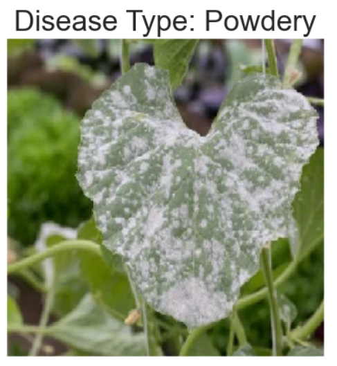
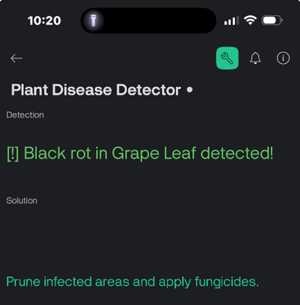
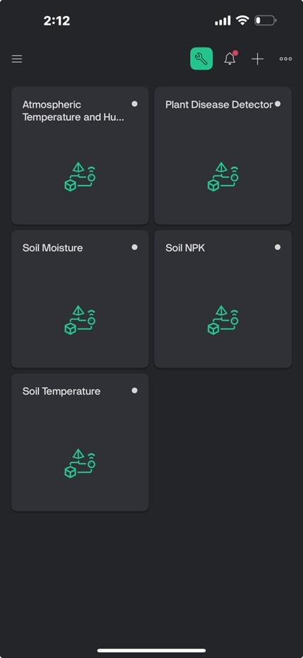
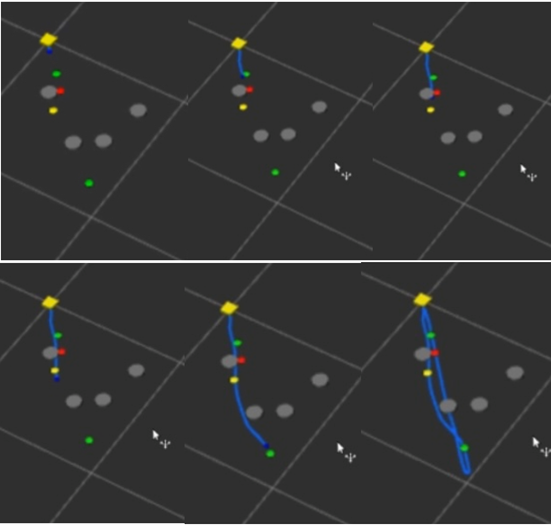

# 🌿 Smart Crop Health Monitoring System
**A Hybrid IoT and Deep Learning Approach for Precision Agriculture**

[](https://www.python.org/downloads/)
[](https://www.arduino.cc/)
[](https://www.espressif.com/)
[](https://releases.ubuntu.com/20.04/)
[](http://wiki.ros.org/melodic)
[](https://husarion.com/manuals/rosbot/)


This project presents an end-to-end smart farming solution. It combines **IoT soil sensing** using ESP32 with **Computer Vision** (YOLOv11 & CNN) to detect and classify diseases in crops like Tomato, Potato, and Chili.

---

## 📂 Project Structure

- **`Dataset/`**: Manually annotated image datasets for YOLO (Detection) and CNN (Classification).
- **`Graphs/`**: Training metrics including Confusion Matrices, P-R Curves, and Loss graphs.
- **`Hardware/`**: Arduino (.ino) code for NPK, DHT11, DS18B20, and Soil Moisture sensors.
- **`Models/`**: `my_model.pt` (YOLOv11) and `model.h5` (CNN - weights hosted on Hugging Face).
- **`Scripts/`**: Python scripts for model training and real-time webcam inference.

---

## 🤖 Machine Learning Performance

### YOLOv11 Detection (Real-Time)
Used for localized disease detection across 7+ crop varieties.
- **Validation Accuracy:** 95%
- **Training Accuracy:** 96%
- **Results:** Precision, Recall, and mAP curves are stored in `/Graphs`.
- **Demo:**
<p align="center">
  
</p>


### CNN Classification
A high-accuracy model for identifying healthy and rust or powdery diseased leaves.
- **Validation Accuracy:** 91%
- **Training Accuracy:** 92%
- **Demo:**
<p align="center">
  
</p>

### After Detection
The results + solution (remedy) for the diseased leaf is sent to the users for real-time monitoring via the **Blynk Mobile App**
<p align="center">
  
</p>

---

## 🛠 Hardware Integration
The system uses an **ESP32** microcontroller to fetch real-time data from:
- **Atmospheric:** DHT11 (Temperature & Humidity)
- **Soil:** NPK Sensor (Nutrients), DS18B20 (Temperature), Capacitive Moisture Sensor.
- **IoT Dashboard:** Real-time monitoring via the **Blynk Mobile App**.
<p align="center">
  
</p>

## 🚀 Autonomous Navigation (ROS Integration)
The system integrates with a **Husarion ROSbot 2 Pro** for autonomous field navigation. While currently used for path execution, the architecture allows for future fusion of Computer Vision (YOLO) and IoT data for dynamic obstacle avoidance.

- **Path Following:** Implemented a custom ROS node to translate waypoints into `geometry_msgs/Twist` commands.
- **Scenario Visualization:** Real-time monitoring of robot state and sensor data via RViz.
- **Launch System:** A single launch file manages the lifecycle of both the navigation and visualization nodes.
- **Navigation:**
<p align="center">
  
</p>


## 📜 Publication

### This project was published as a paper as part of the 15th IEEE International Conference on Control System, Computing and Engineering (ICCSCE 2025).

---

## 🚀 Getting Started

### Installation
1. Clone the repository:
   ```bash
   git clone https://github.com/harshada-lokesh/smart-crop-health-monitoring.git
   cd smart-crop-monitoring

### Running Navigation
2. Run it in Ubuntu Terminal:
   ```bash
   roslaunch smart_crop_monitoring rosbot_navigation.launch
